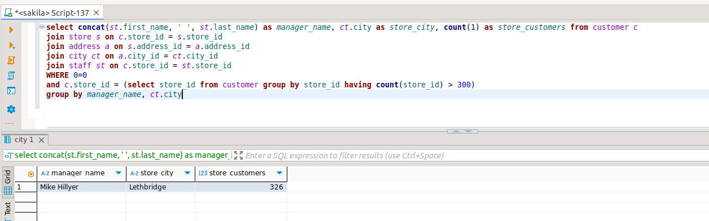
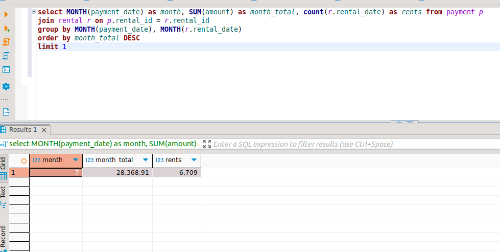

# Домашнее задание к занятию "SQL. Часть 2" - Байков Михаил

### Задание 1

Одним запросом получите информацию о магазине, в котором обслуживается более 300 покупателей, и выведите в результат следующую информацию: 
- фамилия и имя сотрудника из этого магазина;
- город нахождения магазина;
- количество пользователей, закреплённых в этом магазине.

### Решение 1
```
select concat(st.first_name, ' ', st.last_name) as manager_name, ct.city as store_city, count(1) as store_customers from customer c 
join store s on c.store_id = s.store_id 
join address a on s.address_id = a.address_id 
join city ct on a.city_id = ct.city_id 
join staff st on c.store_id = st.store_id 
where
c.store_id = (select store_id from customer group by store_id having count(store_id) > 300)
group by manager_name, ct.city
```



### Задание 2

Получите количество фильмов, продолжительность которых больше средней продолжительности всех фильмов.

### Решение 2
```
select count(*) as length_more_than_avarage
from film  
where length > (select avg(length) from film)
```


### Задание 3

Получите информацию, за какой месяц была получена наибольшая сумма платежей, и добавьте информацию по количеству аренд за этот месяц.

### Решение 3
```
select MONTH(payment_date) as month, SUM(amount) as month_total, count(r.rental_date) as rents from payment p 
join rental r on p.rental_id = r.rental_id 
group by MONTH(payment_date), MONTH(r.rental_date)
order by month_total DESC 
limit 1
```


